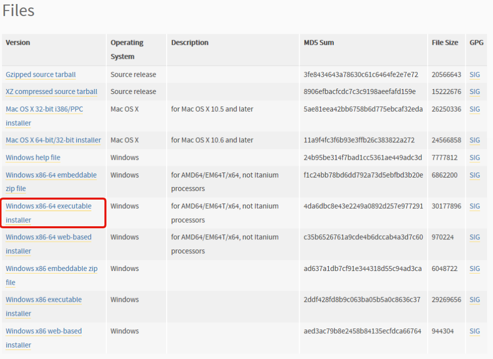
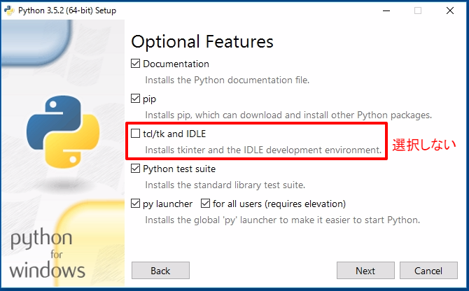

## For Windows

### ターミナルソフトの導入

Python インタプリタを触るときに，
**ターミナル（端末，プロンプト，CLI）** というソフトウェアがあると便利です[^†1]．

まだ用意していない人は，[Tips | Windows でオススメのターミナル環境](./Tips/Windowsターミナル環境構築/README.md) を見てください．

### For Bash on Ubuntu on Windows

Bash on Ubuntu on Windows を使う人は，次のコマンドでインストールできます．
実行したら，これ以降のインストールは必要ありません．

```bash
$ sudo apt update && sudo apt install -y python3 python3-pip
```

### For MSYS2

MSYS2 を使う人は，次のコマンドでインストールできます．
実行したら，これ以降のインストールは必要ありません．

```bash
pacman -S mingw-w64-x86_64-python3 mingw-w64-x86_64-python3-pip
```

### For コマンドプロンプト

#### Python for Windows のインストール

[Python Releases for Windows] の **Latest Python 3 Release** へ移動します（2016/10/9 現在 Python 3.5.2）．

ページ下に，**Windows x86-64 executable installer** があるのでダウンロードします．



ダウンロードしたインストーラーを起動して， **Custom installation** へ進みます．


**td/tk and IDLE** は，今回使わないので選択しません．
それ以外はすべて選択します．



最後に，次の図のように選択します．

- 選択しない
  - Associate files with Python
  - Create shortcuts for installed applications
- **選択する**
  - Add Python to environment variables
  - Precompile standard library


これで無事にインストールできました．


[Python Releases for Windows]: https://www.python.org/downloads/windows/

#### 講義について

この講義では， `python3` コマンドを使います．
Windows版では，それらの代わりに `py -3` コマンドを使います[^†2]．

これ以降の講義については，`python3` を `py -3` に置き換えてください．

一応 `doskey python3=py -3 $*` を使うと，同じコマンドで使えるようになります．
ただし，通常ではコマンドプロンプトを起動するたびに打つ必要があります．

いい感じにしたいひとは，[Big Sky :: Windows ユーザは cmd.exe で生きるべき。](http://mattn.kaoriya.net/software/why-i-use-cmd-on-windows.htm)が参考になります．

-----

[^†1]: Ref. [Tips | ターミナルソフト](./Tips/ターミナルソフト.md)
[^†2]: Ref. [Tips | Python のバージョン](./Tips/Pythonのバージョン.md)
