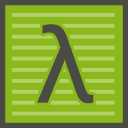

### 環境構築 | Cmder

[Cmder](http://cmder.net/) は，[Conemu](https://conemu.github.io/) ベースの
ターミナルエミュレータです．
zip をダウンロードして展開するだけで，ある程度使える点で便利です．

#### Install

今回はシェル環境は別途インストールするので， **Download mini** をダウンロードします．
ダウンロードした zip を展開して，`C:\Cmder`（もしくは好きな場所）に置いてください．

#### Configure

日本語を使うにあたって，フォントの設定が必要です．
タイトルバーを右クリックしてメニューを表示します．
**Settings** を選択します．

フォント設定の **Monospace** にあるチェックを **外します**．

#### （任意）右クリックメニュー

レジストリを編集して，右クリックメニューに "Open Cmder Here" を追加することができます．
詳しくは， [Cmder Wiki] を見てください．

[Cmder Wiki]: https://github.com/cmderdev/cmder/wiki/%5BWindows%5D-%22Open-Cmder-Here%22-in-context-menu
