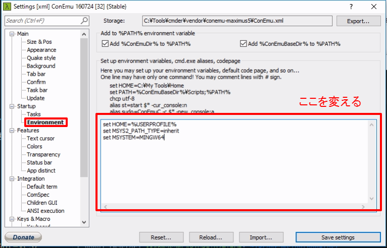

### 環境構築 | MSYS2

#### インストール

http://msys2.github.io/ から
`msys2-x86_64-XXXXXXXX.exe` （X はバージョン番号）を
ダウンロードします．

実行してインストールしますが，
**最後の `Run MSYS2 now` はチェックを外してください**．

#### Cmder で使えるようにする

次の手順で設定します．

- 設定画面を出す
  - タイトルバー右クリック
  - Settings
  - Startup - Tasks
- `Add default tasks` ボタンで自動作成
- `{Bash::Msys2-64}` を選ぶ
  - `Default task for new console` にチェックを付ける
- 設定画面を切り替える
  - Startup - Environment
- `Set up environment variables` に次のように書く
  - ```
    set HOME=%USERPROFILE%
    set MSYS2_PATH_TYPE=inherit
    set MSYSTEM=MINGW64
    ```
- 設定画面を切り替える
  - Startup
- `{Bash::Msys2-64}` を選ぶ
- Cmder を再起動する





#### MSYS2 の設定

`$` から 次の `$` までが1つのコマンドです（`$` は含みません）．

```bash
# 設定ファイルのコピー
$ cp /c/msys64/home/${USER}/.* ${HOME}
# force_color_prompt
$ sed -i ~/.bashrc -e 's/#force_color_prompt=yes/force_color_prompt=yes/'
# ~/.bash_aliases の設定
$ cat <<'EOL' >> ~/.bashrc
if [ -f "${HOME}/.bash_aliases" ]; then
  source "${HOME}/.bash_aliases"
fi
EOL
$ echo "alias ls='ls --color=auto --ignore={ntuser*,NTUSER*}'" >> ~/.bash_aliases
$ exec $SHELL -l
```
